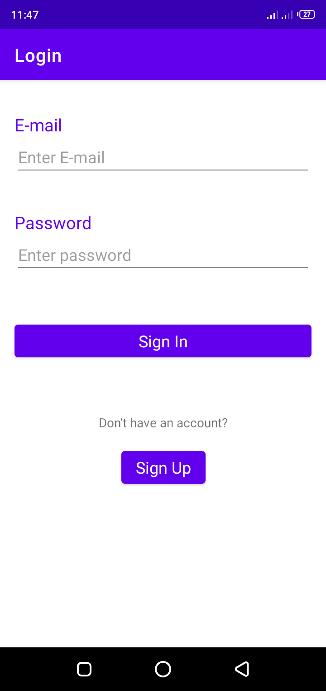
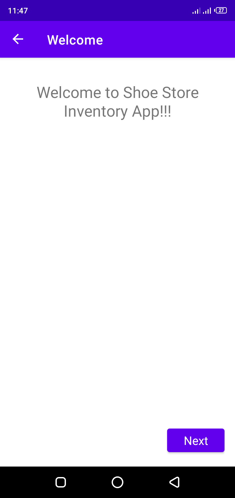
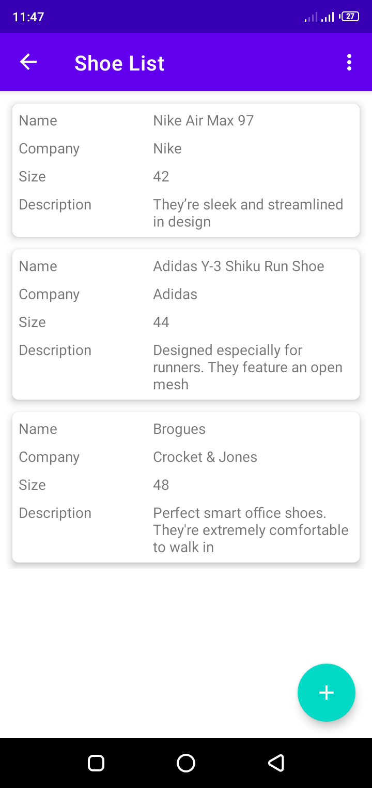
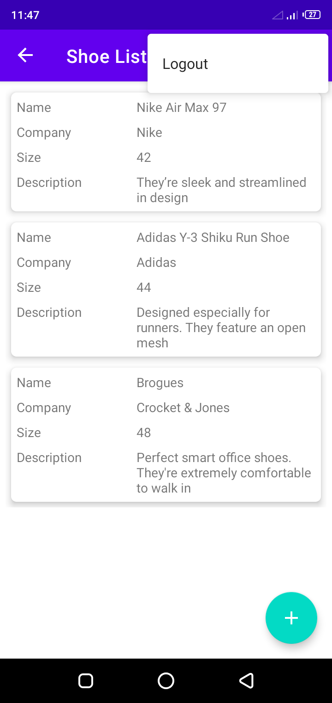
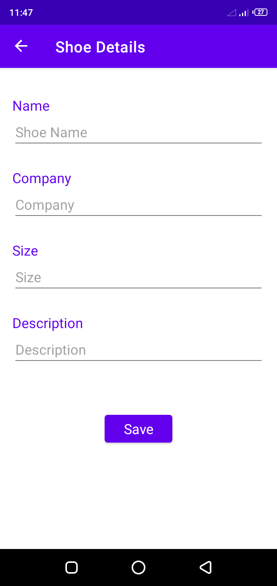

# Shoe-Store-Inventory-App

## About
A Shoe Inventory App that saves and displays a list of shoes added to the inventory

## Features 
* LiveData observation for changes
* Navigating between fragments within a single Activity using Android Jetpack Navigation Component
* Persisting data between fragments using SharedViewModel
* DataBinding of Layouts and Views
* Using ConstraintLayout for flexible positioning and sizing of widgets
* Setting up back ActionBar with NavController
* Dynamic inflation of Layouts

## App Demo
### Login

### Welcome

### Instructions

### Shoe List

### Logout

### Shoe Detail

